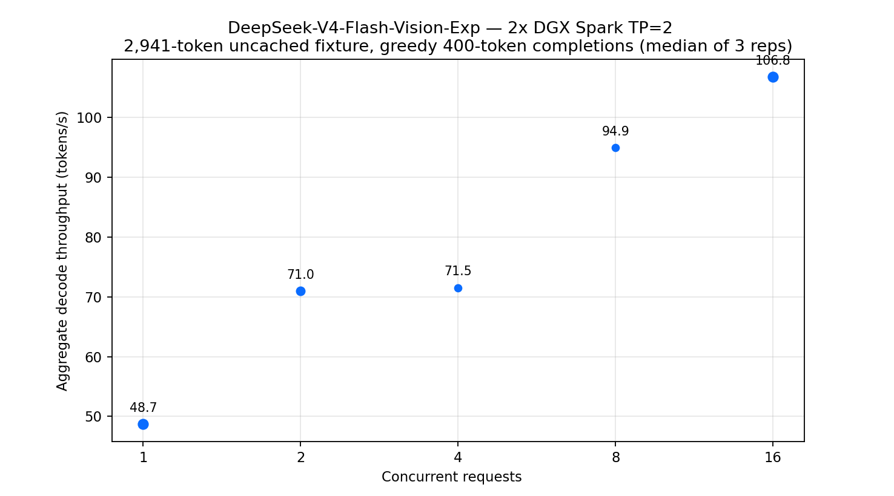

# DeepSeek-V4-Flash-Vision-Exp on 2x DGX Spark (GB10)

Fit/startup/performance evidence for the official
[deepseek-ai/DeepSeek-V4-Flash-Vision-Exp](https://huggingface.co/deepseek-ai/DeepSeek-V4-Flash-Vision-Exp)
checkpoint (FP8 e4m3, 48 shards, 167.83 GB) on a two-node DGX Spark
kit. Status: **MEASURED — single-node capacity gate FAILED (TP=1 cannot
fit); both node-local checkpoints and exact-context Hub authentication
PASS**. This repository
carries the sanitized public evidence trail.

## TL;DR

- **Current state: normalized benchmark COMPLETE on the frozen vLLM TP=2
  recipe** — correctness (text + vision), exact 2,941-token uncached
  prefill, warm streaming TTFT, and the full C1–C16 greedy 400-token
  ladder are measured with zero errors and zero restarts.
- Uncached prefill: 2,941 tokens in 1.877711 s (**1,566.3 tok/s**,
  `cached_tokens=0`). Warm streaming TTFT median **0.323 s**.
- Aggregate decode throughput (median of 3 reps, exactly 400 completion
  tokens per request): **C1 48.7 · C2 71.0 · C4 71.5 · C8 94.9 ·
  C16 106.8 tok/s**. Per-request ranges and full usage live in
  [results/receipts/normalized-ladder-20260901.json](results/receipts/normalized-ladder-20260901.json).
- The source-locked vision-routing optimization was a terminal negative:
  steady C1 fell from **50.36 tok/s** to **42.52 tok/s** (**-15.6%**).
  Text and real-image correctness passed in both arms, the original files
  were restored by hash, and the full treatment ladder was correctly skipped.
- Correctness gates PASS: the fixture answer (10 berths; E3/W2
  cold-iron) and a real image probe (solid red 1x1 PNG, 117 multimodal
  tokens) both answered correctly; the vision prompt never discloses
  the expected answer.
- Single-node TP=1 capacity remains a measured FAIL (167.83 GB FP8
  checkpoint); two-node TP=2 vLLM is the working recipe. The SGLang
  two-node path closed as a measured host-RAM OOM (attempt 3).

The tracked six-phase experiment ledger is
[notebooks/dgx-experiment-ledger.ipynb](notebooks/dgx-experiment-ledger.ipynb),
backed by [results/ledger-state.json](results/ledger-state.json). Future
GPU work is stopped by an explicit notebook guard unless ownership,
integrity, authentication, and safety gates are all clear.

## Gates (2026-08-31, read-only)

| Gate | Result | Evidence |
|---|---|---|
| Ownership | PASS (both nodes; zero foreign GPU compute processes) | prior-owner release + fresh probes |
| OOM stability | PASS; prior hold cleared after a stable observation window | kernel journal, sanitized counts only |
| Accelerators | PASS pre-run (GB10 x2, idle, 45-48 C) | nvidia-smi |
| Interconnect | PASS (RDMA/RoCE peers up on both nodes) | rdma tools |
| Node-local cache media | PASS (writable, non-rotational NVMe on both nodes) | read-only mount/media probe |
| Node-local pinned checkpoint | PASS on both nodes | offline shard/link/index integrity receipts |
| Hub authentication in execution context | PASS on both nodes | boolean-only receipt in exact detached-container context |
| Runtime | PASS (vision vLLM image on both nodes; CUDA 13) | docker images |

See [EVIDENCE.md](EVIDENCE.md) for the full sanitized preflight and
[runs/20260831T1628Z-single-node-tp1.md](runs/20260831T1628Z-single-node-tp1.md)
for the measured single-node run manifest.

## External baseline note (not directly comparable)

The Mia 2x DGX Spark repository README is Vision-Exp-framed today, but its
detailed headline matrices and raw JSON are explicitly dated **0731** and
were produced under a **different protocol**: 256/2K/8K/32K/128K prompt
lengths, concurrency 1/2/4/6, forced 128-token decode windows, unique cold
prefixes, thinking off, and median per-stream decode after first token.
Those numbers are therefore labeled **COMMUNITY-REPORTED 0731 / NOT
DIRECTLY COMPARABLE** with this repository's Vision-Exp ladder (exact
2,941-token fixture, C1-C16, exactly 400 completion tokens, warmup + 3
reps, synchronized aggregate wall). No head-to-head claim is made.

Runtime configuration evidenced in this repository's receipts: vLLM TP=2,
nvfp4_ds_mla KV cache, max_model_len 1,048,576, max_num_seqs 6,
speculative tokens 6, max batched tokens 8192, and
VLLM_USE_BREAKABLE_CUDAGRAPH=0 (regular CUDA graphs). Any knob not
listed here is not claimed as active.

## Ladder status

1. ~~Node-local checkpoint preparation~~ DONE — both nodes PASS.
2. ~~Single-node import/capacity gate~~ DONE — measured CAPACITY_FAIL at TP=1.
3. ~~Two-node TP=2 vLLM serving~~ DONE — frozen recipe, private-overlay API,
   text + vision correctness PASS.
4. ~~Normalized benchmark~~ DONE — exact 2,941-token uncached fixture,
   warm TTFT 0.323 s, C1–C16 ladder (0 errors / 93 requests, 0 restarts,
   peak 75 C). Chart: [assets/normalized-ladder-20260901.png](assets/normalized-ladder-20260901.png);
   video: [assets/normalized-ladder-20260901.mp4](assets/normalized-ladder-20260901.mp4).
5. ~~Pinned vision-routing A/B~~ DONE — treatment regressed steady C1 by
   15.6%; rollback and post-rollback text + image verification PASS.
6. Public-history retention check + independent exact-head review — PENDING;
   do not merge until both gates pass.

## Protocol

- Model pinned at revision
  `86f746b36186f0e567729a5c06a8c918caba82a9`; exact inventory
  target is 82 files / 48 shards / 167,831,846,872 repository bytes.
  Both node-local caches pass.
- Token counts from final usage objects; every material claim labeled
  measured / inferred / community-reported / untested.
- No private infrastructure identifiers, IPs, hostnames, UUIDs, or
  process IDs in this repository.
- Run `python3 tools/hf_auth_preflight.py` inside the exact background
  or container execution context before a download starts or resumes.
  Continue only when its complete output is `{"auth":true}`.
- Run `python3 tools/validate_public_tree.py` before every public push.

## License

MIT. Benchmark code and documentation only — no model weights.
