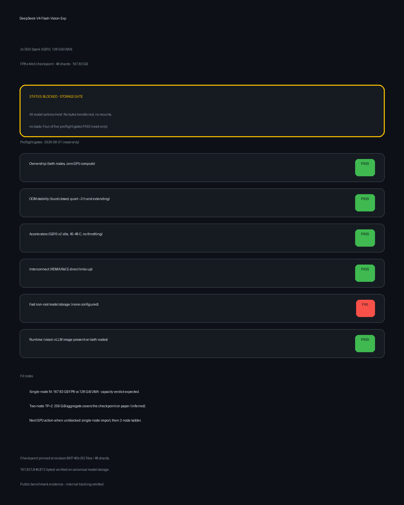

# DeepSeek-V4-Flash-Vision-Exp on 2x DGX Spark (GB10)

Fit/startup/performance evidence for the official
[deepseek-ai/DeepSeek-V4-Flash-Vision-Exp](https://huggingface.co/deepseek-ai/DeepSeek-V4-Flash-Vision-Exp)
checkpoint (FP8 e4m3, 48 shards, 167.83 GB) on a two-node DGX Spark
kit. Status: **BLOCKED at the storage gate — no model action has run
yet**. This repository carries the sanitized public evidence trail.

## TL;DR

- Ownership, accelerator health, OOM stability, and interconnect gates
  all **pass** on both nodes (measured, read-only).
- Storage gate **fails**: neither node exposes a configured writable
  fast non-root model path. Root NVMe (3.7 TB, ~1.6 TB free per node)
  is policy-forbidden for weights; the shared WIP mount is
  policy-forbidden VM boot disk; the central library path is not
  mounted on either node (measured).
- The pinned checkpoint already exists, integrity-verified, on the
  canonical model store (rotational HDD tier, ~7.7 TB free) — no
  re-download is required once a mount or stage path is authorized.
- Planned first GPU action once unblocked: cheapest single-node
  import/capacity gate, then a supported two-node distributed ladder.
  A 167.83 GB FP8 checkpoint vs 128 GiB unified memory per node makes
  single-node fit unlikely; the two-node path is the real question.
- Paper fit notes (inferred, not yet measured): TP=2 aggregate 256 GiB
  covers the checkpoint; supported paths via the prebuilt
  vision runtime image already present on both nodes.

## Gates (2026-08-31, read-only)

| Gate | Result | Evidence |
|---|---|---|
| Ownership | PASS (both nodes; zero GPU compute processes) | sanitized release receipt + fresh probe |
| OOM stability | PASS-EXTENDING (burst ended 21:12 local; 0 OOM/Xid in last 30 min; window now ~3 h) | kernel journal, sanitized counts only |
| Accelerators | PASS (GB10 x2, idle, 45-48 C, no throttle flags) | nvidia-smi |
| Interconnect | PASS (RDMA/RoCE peers up on both nodes) | rdma tools |
| Fast non-root storage | **FAIL** | findmnt/ls probe |
| Runtime | PASS (prebuilt vision runtime image on both nodes; host Docker 29.x, CUDA 13) | docker images |

See [EVIDENCE.md](EVIDENCE.md) for the full sanitized preflight.

## Ladder (planned, gated)

1. Storage unblock (owner action recorded in internal tracking).
2. Single-node import/capacity gate: bounded load attempt with
   memory telemetry; capacity failure is a valid terminal verdict.
3. Two-node distributed ladder: TP=2 via the supported runtime path,
   startup verdict first, then TTFT/decode/throughput at fixed prompts.
4. Terminal verdict + this README updated; node release posted.

## Protocol

- Model pinned at revision
  `86f746b36186f0e567729a5c06a8c918caba82a9`; exact inventory
  (82 files / 48 shards / 167,831,846,872 bytes) verified on the
  canonical copy before any load.
- Token counts from final usage objects; every material claim labeled
  measured / inferred / community-reported / untested.
- No private infrastructure identifiers, IPs, hostnames, UUIDs, or
  process IDs in this repository.

## License

MIT. Benchmark code and documentation only — no model weights.
